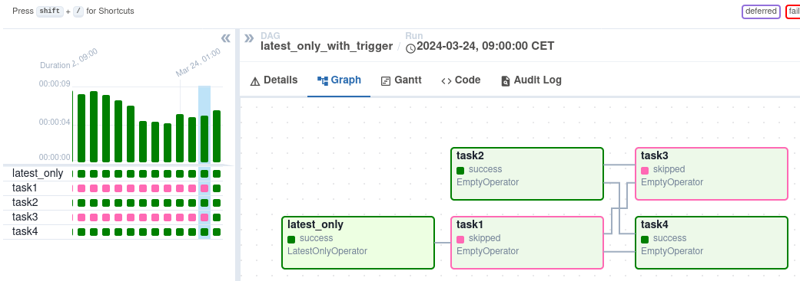
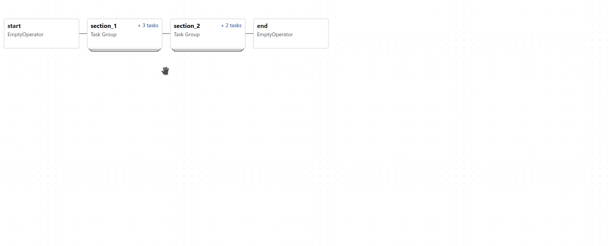
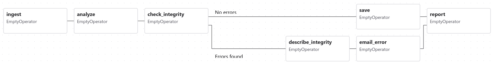

## Dags
A Dag is a model that encapsulates everything needed to execute a workflow. Some Dag attributes include the following:

- Schedule: When the workflow should run.
- Tasks: tasks are discrete units of work that are run on workers.
- Task Dependencies: The order and conditions under which tasks execute.
- Callbacks: Actions to take when the entire workflow completes.
- Additional Parameters: And many other operational details.

---
### Declaring a Dag

There are totally three ways for declaring a DAG

either you can use with statement (context manager), which will add anything inside it to the Dag implicitly:

```
 import datetime

 from airflow.sdk import DAG
 from airflow.providers.standard.operators.empty import EmptyOperator

 with DAG(
     dag_id="my_dag_name",
     start_date=datetime.datetime(2021, 1, 1),
     schedule="@daily",
 ):
     EmptyOperator(task_id="task")
```

Or, you can use a standard constructor, passing the Dag into any operators you use:

``` 
 import datetime

 from airflow.sdk import DAG
 from airflow.providers.standard.operators.empty import EmptyOperator

 my_dag = DAG(
     dag_id="my_dag_name",
     start_date=datetime.datetime(2021, 1, 1),
     schedule="@daily",
 )
 EmptyOperator(task_id="task", dag=my_dag)
```

Or, you can use the @dag decorator to turn a function into a Dag generator:

```
import datetime

from airflow.sdk import dag
from airflow.providers.standard.operators.empty import EmptyOperator


@dag(start_date=datetime.datetime(2021, 1, 1), schedule="@daily")
def generate_dag():
    EmptyOperator(task_id="task")


generate_dag()
```
---
### Task Dependencies

There are two main ways to declare individual task dependencies. The recommended one is to use the >> and << operators:

```
first_task >> [second_task, third_task]
third_task << fourth_task
```

Or, you can also use the more explicit set_upstream and set_downstream methods:


```
first_task.set_downstream([second_task, third_task])
third_task.set_upstream(fourth_task)
```

---
### Loading Dags

Airflow loads Dags from Python source files in Dag bundles. It will take each file, execute it, and then load any Dag objects from that file.

This means you can define multiple Dags per Python file, or even spread one very complex Dag across multiple Python files using imports.

Note, though, that when Airflow comes to load Dags from a Python file, it will only pull any objects at the top level that are a Dag instance. For example, take this Dag file:

```
dag_1 = DAG('this_dag_will_be_discovered')

def my_function():
    dag_2 = DAG('but_this_dag_will_not')

my_function()
```

---
### Running Dags

Dags will run in one of two ways:

- When they are triggered either manually or via the API
- On a defined schedule, which is defined as part of the Dag

Dags do not require a schedule, but it’s very common to define one. You define it via the schedule argument, like this:

```
with DAG("my_daily_dag", schedule="@daily"):
    ...

```

There are various valid values for the schedule argument:

```
with DAG("my_daily_dag", schedule="0 0 * * *"):
    ...

with DAG("my_one_time_dag", schedule="@once"):
    ...

with DAG("my_continuous_dag", schedule="@continuous"):
    ...
```

---
### Default Arguments
Often, many Operators inside a Dag need the same set of default arguments (such as their retries). Rather than having to specify this individually for every Operator, you can instead pass default_args to the Dag when you create it, and it will auto-apply them to any operator tied to it:

```
import pendulum

with DAG(
    dag_id="my_dag",
    start_date=pendulum.datetime(2016, 1, 1),
    schedule="@daily",
    default_args={"retries": 2},
):
    op = BashOperator(task_id="hello_world", bash_command="Hello World!")
    print(op.retries)  # 2
```

---
### The Dag decorator

As well as the more traditional ways of declaring a single Dag using a context manager or the Dag() constructor, you can also decorate a function with @dag to turn it into a Dag generator function:

```
from typing import TYPE_CHECKING, Any

import httpx
import pendulum

from airflow.providers.standard.operators.bash import BashOperator
from airflow.sdk import BaseOperator, dag, task

if TYPE_CHECKING:
    from airflow.sdk import Context


class GetRequestOperator(BaseOperator):
    """Custom operator to send GET request to provided url"""

    template_fields = ("url",)

    def __init__(self, *, url: str, **kwargs):
        super().__init__(**kwargs)
        self.url = url

    def execute(self, context: Context):
        return httpx.get(self.url).json()


@dag(
    schedule=None,
    start_date=pendulum.datetime(2021, 1, 1, tz="UTC"),
    catchup=False,
    tags=["example"],
)
def example_dag_decorator(url: str = "https://httpbingo.org/get"):
    """
    DAG to get IP address and echo it via BashOperator.

    :param url: URL to get IP address from. Defaults to "https://httpbingo.org/get".
    """
    get_ip = GetRequestOperator(task_id="get_ip", url=url)

    @task(multiple_outputs=True)
    def prepare_command(raw_json: dict[str, Any]) -> dict[str, str]:
        external_ip = raw_json["origin"]
        try:
            ipaddress.ip_address(external_ip)
            return {
                "command": f"echo 'Seems like today your server executing Airflow is connected from IP {external_ip}'",
            }
        except ValueError:
            raise ValueError(f"Invalid IP address: '{external_ip}'.")

    command_info = prepare_command(get_ip.output)

    BashOperator(task_id="echo_ip_info", bash_command=command_info["command"])


example_dag = example_dag_decorator()
```

---
### Control Flow

By default, a Dag will only run a Task when all the Tasks it depends on are successful. There are several ways of modifying this, however:

- Branching - select which Task to move onto based on a condition
- Trigger Rules - set the conditions under which a Dag will run a task
- Setup and Teardown - define setup and teardown relationships
- Latest Only - a special form of branching that only runs on Dags running against the present
- Depends On Past - tasks can depend on themselves from a previous run

#### Branching

The @task.branch decorator is much like @task, except that it expects the decorated function to return an ID to a task (or a list of IDs). The specified task is followed, while all other paths are skipped. It can also return None to skip all downstream tasks.

The @task.branch can also be used with XComs allowing branching context to dynamically decide what branch to follow based on upstream tasks. For example:


```
@task.branch(task_id="branch_task")
def branch_func(ti=None):
    xcom_value = int(ti.xcom_pull(task_ids="start_task"))
    if xcom_value >= 5:
        return "continue_task"
    elif xcom_value >= 3:
        return "stop_task"
    else:
        return None


start_op = BashOperator(
    task_id="start_task",
    bash_command="echo 5",
    do_xcom_push=True,
    dag=dag,
)

branch_op = branch_func()

continue_op = EmptyOperator(task_id="continue_task", dag=dag)
stop_op = EmptyOperator(task_id="stop_task", dag=dag)

start_op >> branch_op >> [continue_op, stop_op]
```

If you wish to implement your own operators with branching functionality, you can inherit from BaseBranchOperator, which behaves similarly to @task.branch decorator but expects you to provide an implementation of the method choose_branch.

The @task.branch decorator is recommended over directly instantiating BranchPythonOperator in a Dag. The latter should generally only be subclassed to implement a custom operator.

### Latest Only

Airflow’s Dag Runs are often run for a date that is not the same as the current date - for example, running one copy of a Dag for every day in the last month to backfill some data.

There are situations, though, where you don’t want to let some (or all) parts of a Dag run for a previous date; in this case, you can use the LatestOnlyOperator.

This special Operator skips all tasks downstream of itself if you are not on the “latest” Dag run (if the wall-clock time right now is between its execution_time and the next scheduled execution_time, and it was not an externally-triggered run).

```
import datetime

import pendulum

from airflow.providers.standard.operators.empty import EmptyOperator
from airflow.providers.standard.operators.latest_only import LatestOnlyOperator
from airflow.sdk import DAG, TriggerRule

with DAG(
    dag_id="latest_only_with_trigger",
    schedule=datetime.timedelta(hours=4),
    start_date=pendulum.datetime(2021, 1, 1, tz="UTC"),
    catchup=False,
    tags=["example3"],
) as dag:
    latest_only = LatestOnlyOperator(task_id="latest_only")
    task1 = EmptyOperator(task_id="task1")
    task2 = EmptyOperator(task_id="task2")
    task3 = EmptyOperator(task_id="task3")
    task4 = EmptyOperator(task_id="task4", trigger_rule=TriggerRule.ALL_DONE)

    latest_only >> task1 >> [task3, task4]
    task2 >> [task3, task4]
```




In the case of this Dag:

- task1 is directly downstream of latest_only and will be skipped for all runs except the latest.

- task2 is entirely independent of latest_only and will run in all scheduled periods

- task3 is downstream of task1 and task2 and because of the default trigger rule being all_success will receive a cascaded skip from task1.

- task4 is downstream of task1 and task2, but it will not be skipped, since its trigger_rule is set to all_done.

--- Depends On Past
You can also say a task can only run if the previous run of the task in the previous Dag Run succeeded. To use this, you just need to set the depends_on_past argument on your Task to True.

Note that if you are running the Dag at the very start of its life—specifically, its first ever automated run—then the Task will still run, as there is no previous run to depend on.


### Trigger Rules
By default, Airflow will wait for all upstream (direct parents) tasks for a task to be successful before it runs that task.

However, this is just the default behaviour, and you can control it using the trigger_rule argument to a Task. The options for trigger_rule are:

- all_success (default): All upstream tasks have succeeded

- all_failed: All upstream tasks are in a failed or upstream_failed state

- all_done: All upstream tasks are done with their execution

- all_done_min_one_success: All non-skipped upstream tasks are done with their execution and at least one upstream task has succeeded

- all_skipped: All upstream tasks are in a skipped state

- one_failed: At least one upstream task has failed (does not wait for all upstream tasks to be done)

- one_success: At least one upstream task has succeeded (does not wait for all upstream tasks to be done)

- one_done: At least one upstream task succeeded or failed

- none_failed: All upstream tasks have not failed or upstream_failed - that is, all upstream tasks have succeeded or been skipped

- none_failed_min_one_success: All upstream tasks have not failed or upstream_failed, and at least one upstream task has succeeded.

- none_skipped: No upstream task is in a skipped state - that is, all upstream tasks are in a success, failed, or upstream_failed state

- always: No dependencies at all, run this task at any time

#### Setup and teardown

In data workflows it’s common to create a resource (such as a compute resource), use it to do some work, and then tear it down. Airflow provides setup and teardown tasks to support this need.

--- 

### Dag Visualization

If you want to see a visual representation of a Dag, you have two options:

- You can load up the Airflow UI, navigate to your Dag, and select “Graph”
- You can run airflow dags show, which renders it out as an image file

### TaskGroups

A TaskGroup can be used to organize tasks into hierarchical groups in Graph view. It is useful for creating repeating patterns and cutting down visual clutter.



Dependency relationships can be applied across all tasks in a TaskGroup with the >> and << operators. For example, the following code puts task1 and task2 in TaskGroup group1 and then puts both tasks upstream of task3:

```
 from airflow.sdk import task_group


 @task_group()
 def group1():
     task1 = EmptyOperator(task_id="task1")
     task2 = EmptyOperator(task_id="task2")


 task3 = EmptyOperator(task_id="task3")

 group1() >> task3
```
### Edge Labels
As well as grouping tasks into groups, you can also label the dependency edges between different tasks in the Graph view - this can be especially useful for branching areas of your Dag, so you can label the conditions under which certain branches might run.

To add labels, you can use them directly inline with the >> and << operators:

from airflow.sdk import Label

my_task >> Label("When empty") >> other_task

```

with DAG(
    "example_branch_labels",
    schedule="@daily",
    start_date=pendulum.datetime(2021, 1, 1, tz="UTC"),
    catchup=False,
) as dag:
    ingest = EmptyOperator(task_id="ingest")
    analyse = EmptyOperator(task_id="analyze")
    check = EmptyOperator(task_id="check_integrity")
    describe = EmptyOperator(task_id="describe_integrity")
    error = EmptyOperator(task_id="email_error")
    save = EmptyOperator(task_id="save")
    report = EmptyOperator(task_id="report")

    ingest >> analyse >> check
    check >> Label("No errors") >> save >> report
    check >> Label("Errors found") >> describe >> error >> report
```


---
### Dag Dependencies
While dependencies between tasks in a Dag are explicitly defined through upstream and downstream relationships, dependencies between Dags are a bit more complex. In general, there are two ways in which one Dag can depend on another:

- triggering - TriggerDagRunOperator
- waiting - ExternalTaskSensor

---

### Deadline Alerts
Deadline Alerts allow you to set time thresholds for your Dag runs and automatically respond when those thresholds are exceeded. You can set deadlines relative to a fixed datetime, use one of the available calculated references (like Dag queue time or start time), or implement your own custom reference. When a deadline is exceeded, it triggers a callback which can notify you or take other actions.

```
from datetime import timedelta
from airflow import DAG
from airflow.providers.smtp.notifications.smtp import SmtpNotifier
from airflow.sdk.definitions.deadline import DeadlineAlert, DeadlineReference

with DAG(
    dag_id="email_deadline",
    deadline=DeadlineAlert(
        reference=DeadlineReference.DAGRUN_QUEUED_AT,
        interval=timedelta(minutes=30),
        callback=SmtpNotifier(
            to="team@example.com",
            subject="🚨 Dag {{ dag_run.dag_id }} missed deadline at {{ deadline.deadline_time }}",
            html_content="The Dag Run {{ dag_run.dag_run_id }} has been running for more than 30 minutes since being queued.",
        ),
    ),
):
    EmptyOperator(task_id="task1")
```

---
### Testing a Dag
A simplest way to check validity of a dag is to use the following snippet at the end of the dag definition module:

```
if __name__ == "__main__":
    dag.test()
```

In case you would like to test the Dag against a real Airflow Executor, the same mechanism can be used. Addressing the call with the use_executor flag, the Airflow Executor of currently applied Airflow Configuration will be invoked, and run the workloads of the Dag.

```
dag.test(use_executor=True)
```