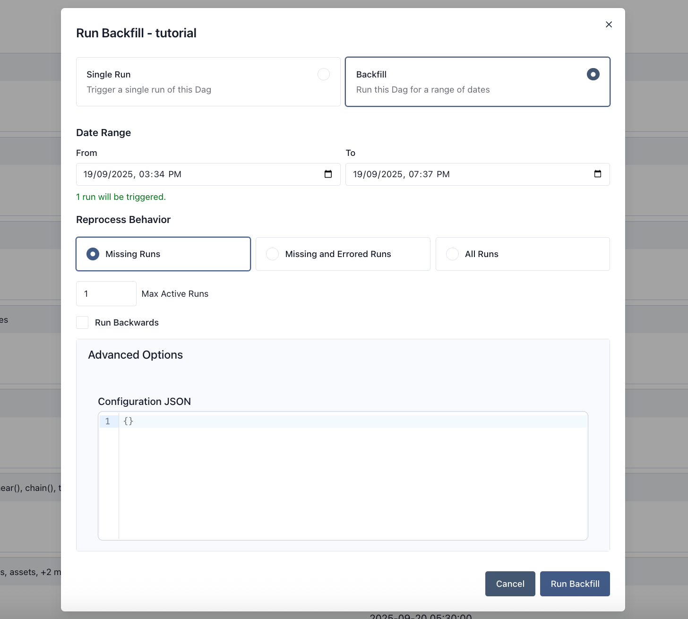

## Backfill
Backfill is when you create runs for past dates of a Dag. Airflow provides a mechanism to do this through the CLI and REST API. You provide a Dag, a start date, and an end date, and Airflow will create runs in the range according to the Dag’s schedule.

Backfill does not make sense for Dags that don’t have a time-based schedule.

### Control over data reprocessing
There are three options for reprocessing behavior:

- none - if there’s already a run for this logical date, do not create another, no matter the state
- failed - if a run exists, if the state is failed, create a new run for this date
- completed - if a run exists, if the state is completed or failed, create a new run for this date

If the latest run is still running or is queued, we do not create another run, no matter the chosen reprocessing behavior.

### Concurrency control
You can set max_active_runs on a backfill and it will control how many Dag runs in the backfill can run concurrently. Backfill max_active_runs is applied independently the Dag max_active_runs setting.

```
airflow backfill create --dag-id tutorial \
    --start-date 2015-06-01 \
    --end-date 2015-06-07 \
    --reprocessing-behavior failed \
    --max-active-runs 3 \
    --run-backwards \
    --dag-run-conf '{"my": "param"}'
```

