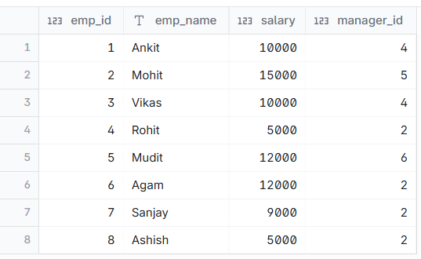
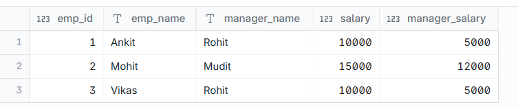

# Employee Salary higher than Manager's

--- 
## INPUT



---

## OUTPUT



---

## DATA PREPARATION

```
create table emp(emp_id int,emp_name varchar(10),salary int ,manager_id int);

insert into emp values(1,'Ankit',10000,4);
insert into emp values(2,'Mohit',15000,5);
insert into emp values(3,'Vikas',10000,4);
insert into emp values(4,'Rohit',5000,2);
insert into emp values(5,'Mudit',12000,6);
insert into emp values(6,'Agam',12000,2);
insert into emp values(7,'Sanjay',9000,2);
insert into emp values(8,'Ashish',5000,2);

select * from emp;

```

---

## SQL SOLUTION OVERVIEW

```
select
    e.emp_id,
    e.emp_name,
    m.emp_name as manager_name,
    e.salary,
    m.salary as manager_salary
from
    emp e
    inner join emp m on e.manager_id = m.emp_id
where
    e.salary > m.salary;

```

--- 