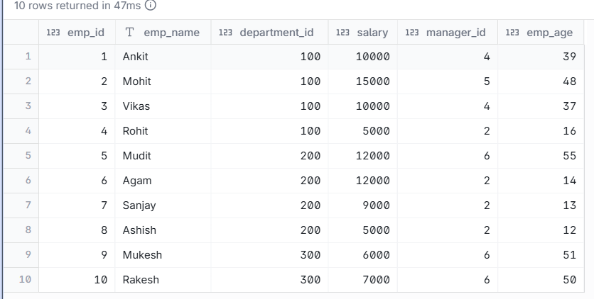
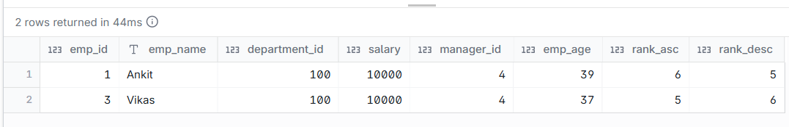

# Find the median age of the employees. Median means, order the age in an order and get th age in exact middle position.

--- 
## INPUT



---

## OUTPUT



---

## DATA PREPARATION

```
create table emp(
emp_id int,
emp_name varchar(20),
department_id int,
salary int,
manager_id int,
emp_age int);

insert into emp
values
(1, 'Ankit', 100,10000, 4, 39),
(2, 'Mohit', 100, 15000, 5, 48),
(3, 'Vikas', 100, 10000,4,37),
(4, 'Rohit', 100, 5000, 2, 16),
(5, 'Mudit', 200, 12000, 6,55),
(6, 'Agam', 200, 12000,2, 14),
(7, 'Sanjay', 200, 9000, 2,13),
(8, 'Ashish', 200,5000,2,12),
(9, 'Mukesh',300,6000,6,51),
(10, 'Rakesh',300,7000,6,50);
```

---

## SQL SOLUTION OVERVIEW

```
with
    ord_rank as (
        select
            e.*,
            row_number() over (
                order by
                    emp_age
            ) as rank_asc,
            row_number() over (
                order by
                    emp_age desc
            ) as rank_desc
        from
            emp e
    )
select
    *
from
    ord_rank
where
    abs(rank_asc - rank_desc) <= 1

```
--- 