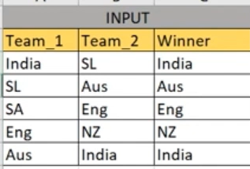
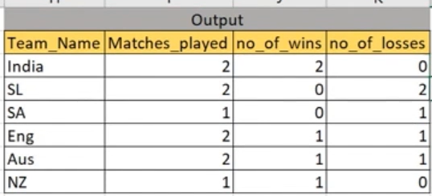

# ICC Cricket points Table

--- 
## INPUT



---

## OUTPUT



---

## DATA PREPARATION

```
create table icc_world_cup
(
Team_1 Varchar(20),
Team_2 Varchar(20),
Winner Varchar(20)
);
INSERT INTO icc_world_cup values('India','SL','India');
INSERT INTO icc_world_cup values('SL','Aus','Aus');
INSERT INTO icc_world_cup values('SA','Eng','Eng');
INSERT INTO icc_world_cup values('Eng','NZ','NZ');
INSERT INTO icc_world_cup values('Aus','India','India');

select * from icc_world_cup;
```

---

## SQL SOLUTION OVERVIEW

```
WITH combined_data AS
(
	SELECT  team_1
	       ,team_2
	       ,winner
	FROM icc_world_cup
	UNION
	SELECT  team_2
	       ,team_1
	       ,winner
	FROM icc_world_cup
) , winner_flag AS
(
	SELECT  team_1
	       ,winner
	       ,CASE WHEN team_1 = winner THEN 1  ELSE 0 END AS win_flag
	FROM combined_data
)
SELECT  team_1
       ,COUNT(team_1)                   AS matches_played
       ,SUM(win_flag)                   AS no_of_wins
       ,(COUNT(team_1) - SUM(win_flag)) AS no_of_losses
FROM winner_flag
GROUP BY  team_1
```

--- 
