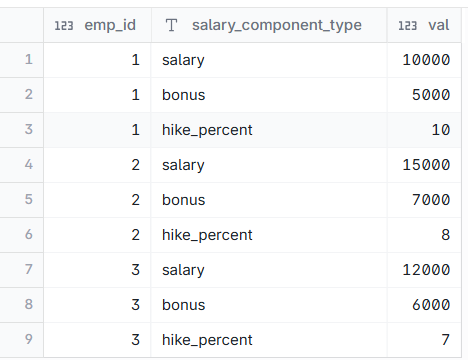
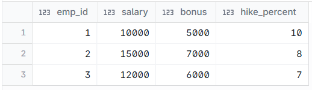

# Employee salary Pivot - 2 approaches

--- 
## INPUT



---

## OUTPUT



---

## DATA PREPARATION

```
create table emp_compensation (
emp_id int,
salary_component_type varchar(20),
val int
);

insert into emp_compensation
values (1,'salary',10000),(1,'bonus',5000),(1,'hike_percent',10)
, (2,'salary',15000),(2,'bonus',7000),(2,'hike_percent',8)
, (3,'salary',12000),(3,'bonus',6000),(3,'hike_percent',7);

select * from emp_compensation;alues(8,'Ashish',5000,2);

select * from emp;

```

---

## SQL SOLUTION OVERVIEW

```
with
    temp_pivot as (
        select
            emp_id,
            case
                when salary_component_type = 'salary' then val
                else null
            end as salary,
            case
                when salary_component_type = 'bonus' then val
                else null
            end as bonus,
            case
                when salary_component_type = 'hike_percent' then val
                else null
            end as hike_percent
        from
            emp_compensation
    )
select
    emp_id,
    sum(salary) as salary,
    sum(bonus) as bonus,
    sum(hike_percent) as hike_percent
from
    temp_pivot
group by
    emp_id


```

```
select
    emp_id,
    salary,
    bonus,
    hike_percent
from
    (
        select
            emp_id,
            salary_component_type,
            val
        from
            emp_compensation
    ) as Source_table pivot (
        max(val) for salary_component_type in ('salary', 'bonus', 'hike_percent')
    ) as Pivot_table
```
--- 