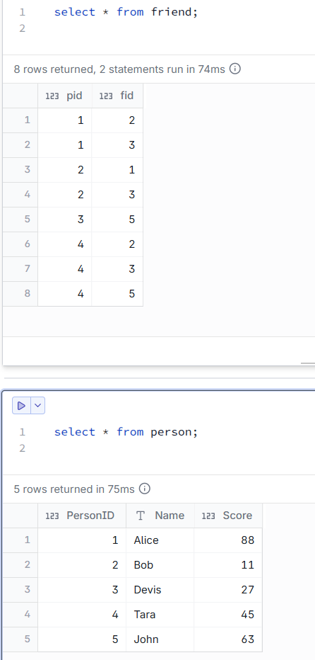
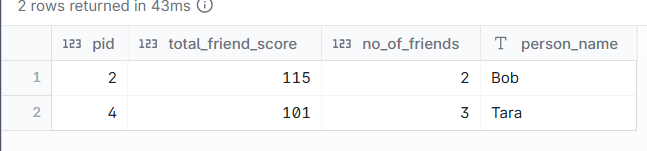

# List of persons whose friends total marks are greater than 100

--- 
## INPUT



---

## OUTPUT



---

## DATA PREPARATION

```
Create table friend (pid int, fid int);
insert into friend (pid , fid ) values ('1','2');
insert into friend (pid , fid ) values ('1','3');
insert into friend (pid , fid ) values ('2','1');
insert into friend (pid , fid ) values ('2','3');
insert into friend (pid , fid ) values ('3','5');
insert into friend (pid , fid ) values ('4','2');
insert into friend (pid , fid ) values ('4','3');
insert into friend (pid , fid ) values ('4','5');

create table person (PersonID int,	Name varchar(50),	Score int);
insert into person(PersonID,Name ,Score) values('1','Alice','88');
insert into person(PersonID,Name ,Score) values('2','Bob','11');
insert into person(PersonID,Name ,Score) values('3','Devis','27');
insert into person(PersonID,Name ,Score) values('4','Tara','45');
insert into person(PersonID,Name ,Score) values('5','John','63');

select * from friend;
```

---

## SQL SOLUTION OVERVIEW

```

with
    friend_marks as (
        select
            pid,
            count(*) as no_of_friends,
            sum(score) as total_friend_score
        from
            friend f
            inner join person p on f.fid = p.personid
        group by
            pid
        having
            sum(score) > 100
    )
select
    pid ,
    total_friend_score,
    no_of_friends,
    name as person_name
from
    friend_marks f
    inner join person p on p.personid = f.pid


```

--- 