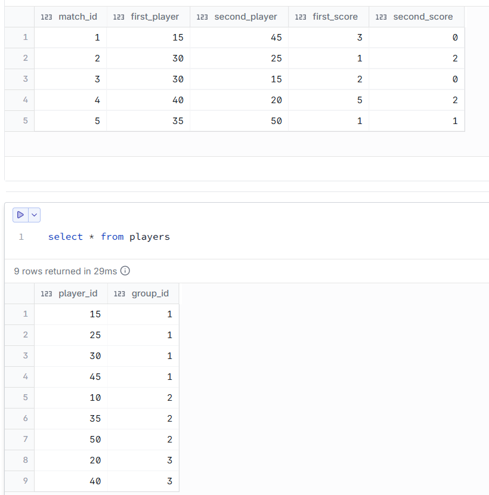
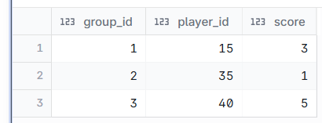

# Find the winner of each group. The player with most points is the winner. If poitns tie, the payer with lower ID is the winner.

--- 
## INPUT



---

## OUTPUT



---

## DATA PREPARATION

```
create table players
(player_id int,
group_id int) ;

insert into players values (15,1);
insert into players values (25,1);
insert into players values (30,1);
insert into players values (45,1);
insert into players values (10,2);
insert into players values (35,2);
insert into players values (50,2);
insert into players values (20,3);
insert into players values (40,3);

create table matches
(
match_id int,
first_player int,
second_player int,
first_score int,
second_score int) ;

insert into matches values (1,15,45,3,0);
insert into matches values (2,30,25,1,2);
insert into matches values (3,30,15,2,0);
insert into matches values (4,40,20,5,2);
insert into matches values (5,35,50,1,1);
```

---

## SQL SOLUTION OVERVIEW

```
    WITH com_player AS (
        SELECT first_player,  first_score
        FROM matches
        UNION ALL                                    
        SELECT second_player, second_score
        FROM matches
    ),
    group_points AS (
        SELECT
            first_player,
            group_id,
            SUM(first_score) AS total_score,
            ROW_NUMBER() OVER (
                PARTITION BY group_id
                ORDER BY SUM(first_score) DESC,      
                        first_player ASC
            ) AS point_rank
        FROM com_player c
        INNER JOIN players p ON c.first_player = p.player_id
        GROUP BY first_player, group_id             
    )
    SELECT
        group_id,
        first_player as player_id,
        total_score as score
    FROM group_points
    WHERE point_rank = 1
    ORDER BY group_id;                               
```
--- 