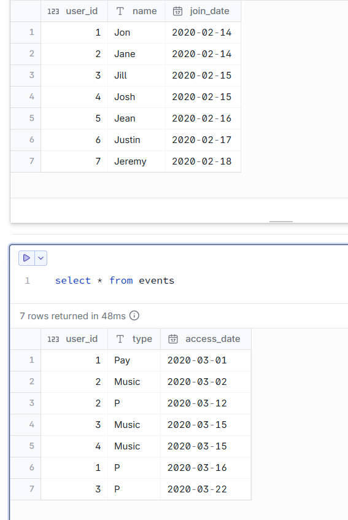
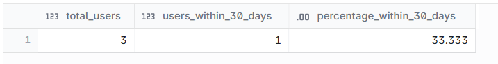

# Find the fraction (ratio) of users who:

Accessed Amazon Music, and

Upgraded to Prime membership (event type = 'P') within 30 days of signing up

Important Notes

Consider only users who accessed Amazon Music

Prime purchase must happen within 30 days of the user’s join_date

Output should be a single value (conversion rate)

--- 
## INPUT



---

## OUTPUT



---

## DATA PREPARATION

```
CREATE TABLE users
(
    user_id   INTEGER,
    name      VARCHAR(20),
    join_date DATE
);

INSERT INTO users VALUES 
(1, 'Jon',    '2020-02-14'), 
(2, 'Jane',   '2020-02-14'), 
(3, 'Jill',   '2020-02-15'), 
(4, 'Josh',   '2020-02-15'), 
(5, 'Jean',   '2020-02-16'), 
(6, 'Justin', '2020-02-17'),
(7, 'Jeremy', '2020-02-18');

CREATE TABLE events
(
    user_id     INTEGER,
    type        VARCHAR(10),
    access_date DATE
);

INSERT INTO events VALUES
(1, 'Pay',   '2020-03-01'), 
(2, 'Music', '2020-03-02'), 
(2, 'P',     '2020-03-12'),
(3, 'Music', '2020-03-15'), 
(4, 'Music', '2020-03-15'), 
(1, 'P',     '2020-03-16'), 
(3, 'P',     '2020-03-22');
```

---

## SQL SOLUTION OVERVIEW

```
    with
        joined_table as (
            select
                u.*,
                type,
                access_date,
                case
                    when type = 'P' then access_date
                    else null
                end as prime_membership_date,
                case
                    when type = 'Music' then access_date
                    else null
                end as music_date
            from
                users u
                inner join events e on e.user_id = u.user_id
        ),
        grouped_table as (
            select
                user_id,
                name,
                max(join_date) as join_date,
                max(prime_membership_date) as prime_membership_date,
                max(music_date) as music_date
            from
                joined_table
            group by
                user_id,
                name
        ),
        total_users as (
            select
                count(user_id) as t_users 
            from
                users T INNER JOIN EVENTS E ON T.USER_ID = E.USER_ID WHERE E.TYPE = 'Music'
        ),
        activated_users as (
            select
                count(*) as a_users
            from
                grouped_table g
            where
                datediff ('day', join_date, prime_membership_date) <= 30
                and music_date is not null
        )
    select
        t_users as total_users,
        a_users as users_within_30_days,
        cast(((a_users * 100) / t_users) as decimal) as percentage_within_30_days
    from
        total_users
        cross join activated_users


```
--- 