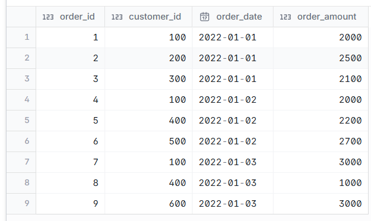
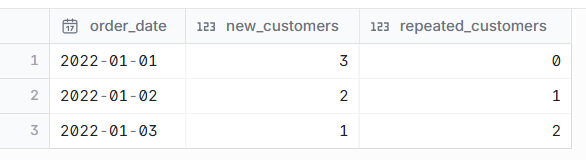

# Get count of First time customers and Repeated customers

--- 
## INPUT



---

## OUTPUT



---

## DATA PREPARATION

```
create table customer_orders (
order_id integer,
customer_id integer,
order_date date,
order_amount integer
);

insert into customer_orders values(1,100,cast('2022-01-01' as date),2000),(2,200,cast('2022-01-01' as date),2500),(3,300,cast('2022-01-01' as date),2100)
,(4,100,cast('2022-01-02' as date),2000),(5,400,cast('2022-01-02' as date),2200),(6,500,cast('2022-01-02' as date),2700)
,(7,100,cast('2022-01-03' as date),3000),(8,400,cast('2022-01-03' as date),1000),(9,600,cast('2022-01-03' as date),3000);


select * from customer_orders;

```

---

## SQL SOLUTION OVERVIEW

```
with
    customer_count as (
        select
            customer_id,
            min(order_date) as first_visit
        from
            customer_orders
        group by
            customer_id
    ),
    visit_frequency as (
        select
            order_date,
            o.customer_id,
            first_visit,
            case
                when order_date = first_visit then 1
                else 0
            end as first_customer,
            case
                when order_date != first_visit then 1
                else 0
            end as repeated_customer
        from
            customer_orders o
            inner join customer_count c on o.customer_id = c.customer_id
    )
select
    order_date,
    sum(first_customer) as new_customers,
    sum(repeated_customer) as repeat_customers
from
    visit_frequency
group by
    order_date
order by
    order_date


```

--- 