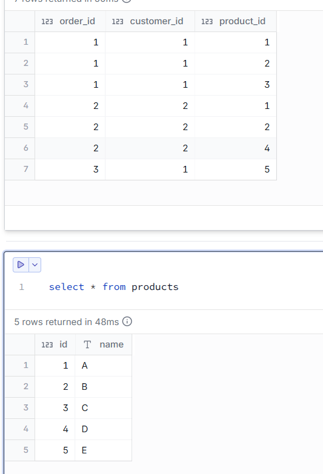
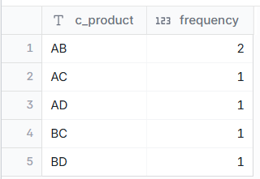

# Find all unique pairs of products that were purchased together in the same order and count how many times each pair was bought together.

--- 
## INPUT



---

## OUTPUT



---

## DATA PREPARATION

```
create table orders
(
order_id int,
customer_id int,
product_id int,
);

insert into orders VALUES 
(1, 1, 1),
(1, 1, 2),
(1, 1, 3),
(2, 2, 1),
(2, 2, 2),
(2, 2, 4),
(3, 1, 5);

create table products (
id int,
name varchar(10)
);
insert into products VALUES 
(1, 'A'),
(2, 'B'),
(3, 'C'),
(4, 'D'),
(5, 'E');
```

---

## SQL SOLUTION OVERVIEW

```
with
    combined_product as (
        select
            o.*,
            p.id,
            p.name as product_1,
            p2.name as product_2,
            concat (product_1, product_2) as c_product
        from
            orders o
            inner join products p on o.product_id = p.id
            inner join orders o2 on o.order_id = o2.order_id
            inner join products p2 on p2.id = o2.product_id
        where
            p.name < p2.name
        order by
            order_id,
            product_1,
            product_2
    )
select
    c_product,
    count(*) as frequency
from
    combined_product
group by
    c_product
order by
    c_product
    
```
--- 