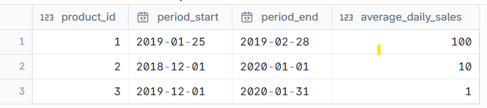
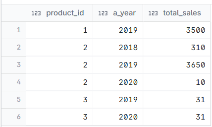

# Find the toal sales of each product for each year

--- 
## INPUT



---

## OUTPUT



---

## DATA PREPARATION

```
create table sales (
    product_id int,
    period_start date,
    period_end date,
    average_daily_sales int
);

insert into
    sales
values
    (1, '2019-01-25', '2019-02-28', 100),
    (2, '2018-12-01', '2020-01-01', 10),
    (3, '2019-12-01', '2020-01-31', 1);


```

---

## SQL SOLUTION OVERVIEW

```
with RECURSIVE
    s_days as (
        select
            product_id,
            period_start,
            period_end,
            average_daily_sales,
            period_start as sales_date
        from
            sales
        union all
        select
            product_id,
            period_start,
            period_end,
            average_daily_sales,
            sales_date + 1 as sales_date
        from
            s_days
        where
            sales_date < period_end
    )
select
    PRODUCT_ID,
    year (sales_date) as a_year,
    sum(average_daily_sales) as total_sales
from
    s_days
group by
    product_id,
    a_year
order by
    product_id,
    a_year
    
```
--- 