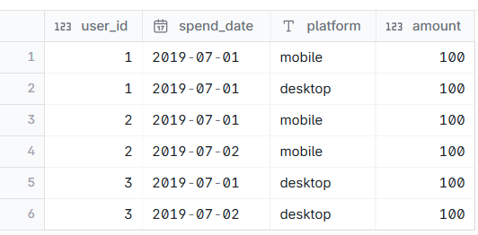
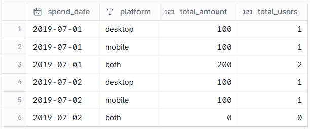

# Find total amount and users fon each platform each day

--- 
## INPUT



---

## OUTPUT



---

## DATA PREPARATION

```
with
    combined_data as (
        select
            spend_date,
            platform,
            count(*) as total_sales,
            sum(amount) as total_amount
        from
            spending
        group by
            spend_date,
            platform
        order by
            spend_date,
            platform
    )
select
    *
from
    combined_data
union
select
    spend_date,
    'both' as platform,
    sum(total_sales) as total_sales,
    sum(total_amount) as total_amount
from
    combined_data
group by
    spend_date,
    platform

```

---

## SQL SOLUTION OVERVIEW

```
WITH
    unique_date as (
        select distinct
            spend_date as p_spend_date
        from
            spending
    ),
    unique_platform as (
        select
            * as p_platform
        from
            (
                values
                    ('desktop'),
                    ('mobile'),
                    ('desktop,mobile')
            )
    ),
    combined_data AS (
        SELECT
            user_id,
            spend_date,
            string_agg (
                platform,
                ','
                order by
                    platform
            ) as platform,
            SUM(amount) AS total_amount,
            COUNT(*) AS total_sales
        FROM
            spending
        GROUP BY
            spend_date,
            user_id
    )
SELECT
    p_spend_date as spend_date,
    case
        when p_platform = 'desktop,mobile' then 'both'
        else p_platform
    end as platform,
    coalesce(total_amount, 0) as total_amount,
    coalesce(total_sales, 0) as total_users
FROM
    unique_date
    cross join unique_platform
    left join combined_data on spend_date = p_spend_date
    and platform = p_platform

```
--- 