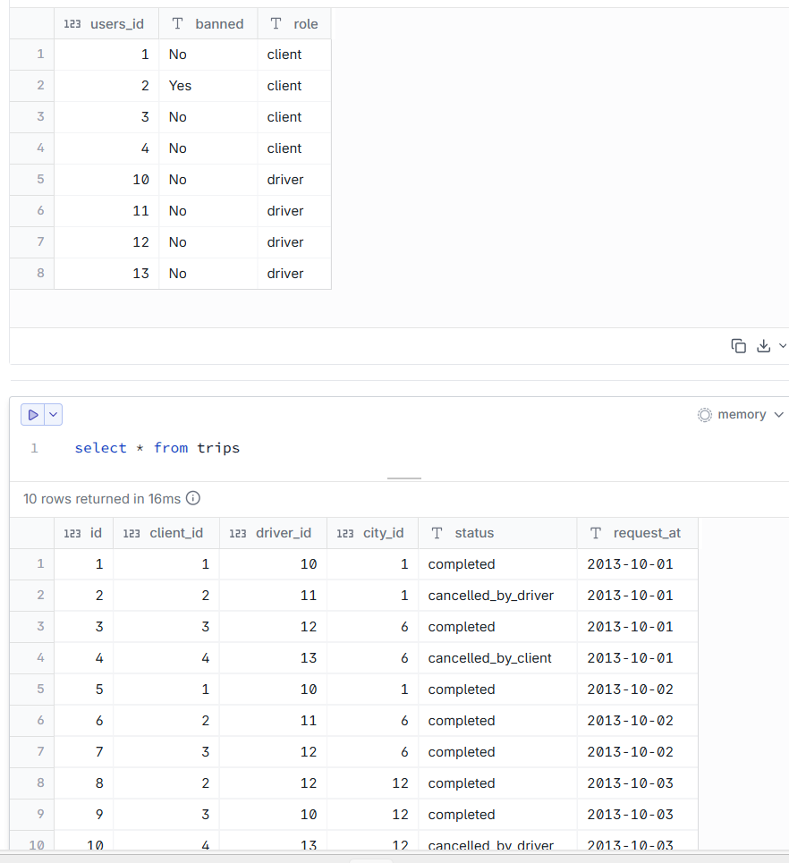
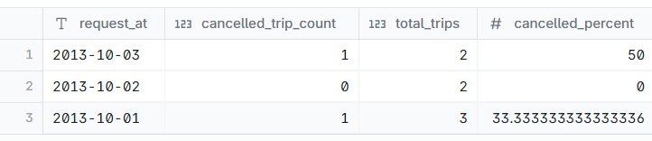

# TRIPS - Need to find the ratio of cancelled trips to total trips. Consider the trip only if both the driver and user are not banned

--- 
## INPUT



---

## OUTPUT



---

## DATA PREPARATION

```
Refer the script file. Text is too large to paste here

```

---

## SQL SOLUTION OVERVIEW

```
with
    unbanned_users as (
        select
            *
        from
            users
        where
            banned = 'No'
    ),
    unbanned_trips as (
        select
            t.*,
            case
                when status = 'completed' then 0
                else 1
            end as t_status
        from
            trips t
        where
            client_id in (
                select
                    users_id
                from
                    unbanned_users
            )
            and driver_id in (
                select
                    users_id
                from
                    unbanned_users
            )
    )
select
    request_at,
    sum(t_status) as cancelled_trip_count,
    count(*) as total_trips,
    (sum(t_status) * 100) / count(*) as cancelled_percent
from
    unbanned_trips
group by
    request_at

```
--- 