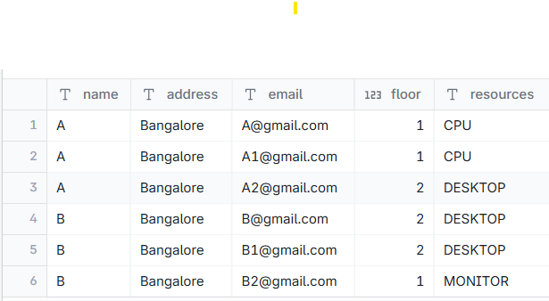
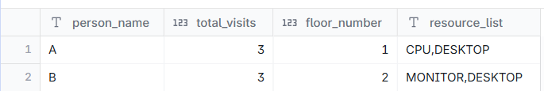

# Floor - Number of visits, Most visited floor and Resources used

--- 
## INPUT



---

## OUTPUT



---

## DATA PREPARATION

```

create table entries ( 
name varchar(20),
address varchar(20),
email varchar(20),
floor int,
resources varchar(10));

insert into entries 
values ('A','Bangalore','A@gmail.com',1,'CPU'),('A','Bangalore','A1@gmail.com',1,'CPU'),('A','Bangalore','A2@gmail.com',2,'DESKTOP')
,('B','Bangalore','B@gmail.com',2,'DESKTOP'),('B','Bangalore','B1@gmail.com',2,'DESKTOP'),('B','Bangalore','B2@gmail.com',1,'MONITOR');

select * from entries;

```

---

## SQL SOLUTION OVERVIEW

```
WITH
    person_visit_counts AS (
        SELECT
            name AS person_name,
            COUNT(*) AS total_visits
        FROM
            entries
        GROUP BY
            name
    ),
    person_floor_visit_counts AS (
        SELECT
            name AS person_name,
            floor AS floor_number,
            COUNT(*) AS visits_on_floor
        FROM
            entries
        GROUP BY
            name,
            floor
    ),
    person_max_floor_visits AS (
        SELECT
            person_name,
            MAX(visits_on_floor) AS max_visits_on_floor
        FROM
            person_floor_visit_counts
        GROUP BY
            person_name
    ),
    person_preferred_floors AS (
        SELECT
            pfvc.person_name,
            pfvc.floor_number
        FROM
            person_floor_visit_counts AS pfvc
            INNER JOIN person_max_floor_visits AS pmfv ON pfvc.person_name = pmfv.person_name
            AND pfvc.visits_on_floor = pmfv.max_visits_on_floor
    ),
    person_distinct_resources AS (
        SELECT DISTINCT
            name AS person_name,
            resources
        FROM
            entries
    ),
    person_resource_list AS (
        SELECT
            person_name,
            LISTAGG (resources) AS resource_list
        FROM
            person_distinct_resources
        GROUP BY
            person_name
    ),
    person_visit_overview AS (
        SELECT
            pvc.person_name,
            pvc.total_visits,
            prl.resource_list
        FROM
            person_visit_counts AS pvc
            INNER JOIN person_resource_list AS prl ON pvc.person_name = prl.person_name
    )
SELECT
    pvo.person_name,
    pvo.total_visits,
    ppf.floor_number,
    pvo.resource_list
FROM
    person_visit_overview AS pvo
    INNER JOIN person_preferred_floors AS ppf ON pvo.person_name = ppf.person_name
ORDER BY
    pvo.person_name,
    ppf.floor_number;


```

--- 